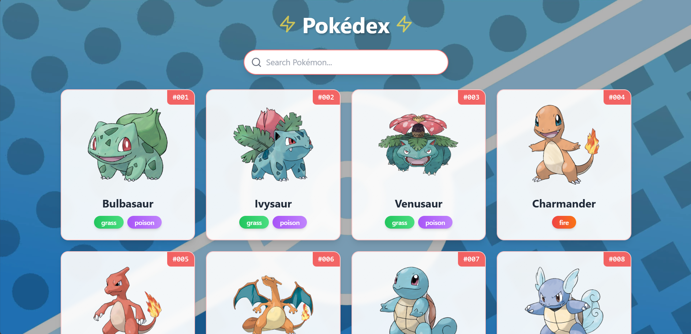
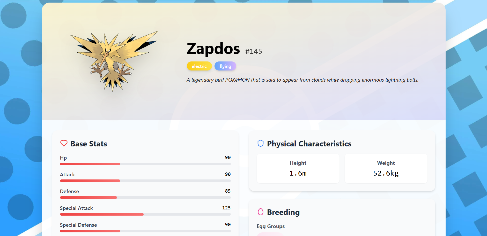
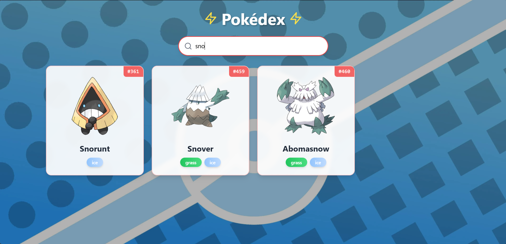

# Pokedex - Your Journey to Become a Pokémon Master 🌟

Welcome, Trainer! The world of Pokémon awaits you! 🌍✨ As a budding Pokémon Master, your mission is to explore, learn, and catalog every Pokémon in existence. With the **Pokedex**, a modern React and TypeScript application, you’ll have the ultimate tool to guide you on your journey. Whether you're venturing into the tall grass for the first time or you're a seasoned Champion, this app is your trusted companion to "catch 'em all!"

This project was proudly built as part of **MLH GHW: API Week**, combining the power of modern web technologies with the magic of the Pokémon universe. 🛠️🎉

## Features 🕹️

- ⚡ **Modern React Application**: Built with TypeScript for type safety and scalability.
- 🎨 **Responsive Design**: Styled with Tailwind CSS to look great on any device, from PokéNavs to desktops.
- 🗺️ **Seamless Navigation**: Powered by React Router for smooth transitions between regions.
- ✨ **Beautiful Icons**: Enhanced with Lucide React for a polished and immersive experience.
- 🛠️ **Code Quality**: Ensured with ESLint for clean and maintainable code.
- 🚀 **Blazing Fast**: Developed with Vite for lightning-fast builds and development.

## Website Screenshots 📸

Take a sneak peek at the Pokedex in action:

-  Home Page


-  Pokémon Details


-  Search Functionality


-  Loader


## Prerequisites 🛡️

Before you set off on your adventure, make sure you have the following tools in your Trainer's toolkit:

- 🖥️ **Node.js** (version 14 or higher)
- 📦 **npm** or **yarn** package manager

## Installation 🧰

1. **Clone the Repository**: Capture this project into your local environment like a wild Pokémon.
   ```bash
   git clone https://github.com/Soumasish2005/pokedex.git
   cd pokedex
   ```

2. **Install Dependencies**: Gather all the necessary items for your adventure.
   ```bash
   npm install
   # or
   yarn install
   ```

## Available Scripts 🎮

- `npm run dev` - Begin your journey in development mode.
- `npm run build` - Prepare your Pokedex for production battles.
- `npm run preview` - Preview your production-ready Pokedex.
- `npm run lint` - Ensure your code is as sharp as a Scyther's blade.

## Project Structure 🏗️

```
pokedex/
├── public/          # Static assets (Pokéballs, maps, etc.)
├── src/
│   ├── assets/      # Pokémon images and other assets
│   ├── components/  # React components (like Pokédex entries)
│   ├── types.ts     # TypeScript type definitions for Pokémon
│   ├── App.tsx      # Main application component
│   ├── main.tsx     # Application entry point
│   └── index.css    # Global styles
├── .eslintrc.js     # ESLint configuration
├── tsconfig.json    # TypeScript configuration
├── vite.config.ts   # Vite configuration
└── package.json     # Project dependencies
```

## Technologies Used 🔧

- 🟦 **React 18**
- 🟨 **TypeScript**
- ⚡ **Vite**
- 🎨 **Tailwind CSS**
- 🗺️ **React Router**
- ✨ **Lucide React**
- 🛠️ **ESLint**

## Contributing 🤝

Do you have what it takes to help improve the Pokedex? Follow these steps to contribute:

1. **Fork the Repository**: Create your own copy of the project.
2. **Create a Feature Branch**: (`git checkout -b feature/amazing-feature`)
3. **Commit Your Changes**: (`git commit -m 'Add some amazing feature'`)
4. **Push to the Branch**: (`git push origin feature/amazing-feature`)
5. **Open a Pull Request**: Share your work with the community!

## License 📜

This project is licensed under the **MIT License**. See the LICENSE file for details.

## Acknowledgments 🎉

- 🐾 **[Pokemon API](https://pokeapi.co/)**: For providing the data that powers this Pokedex.
- 🌟 **MLH GHW: API Week**: For inspiring this project and fostering creativity.
- 🌟 **Contributors**: Thank you to all the Trainers who have helped shape this project.

---

May your journey be filled with adventure, and may you catch 'em all! 🏆